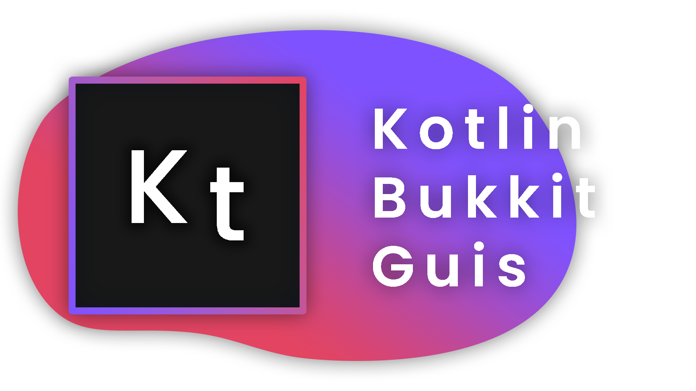

    

<h2 align="center">Declarative guis for Paper!</h2>

The KtGUI library provides a plethora of utilities to help speed up the development of your PaperMC plugins.

<h3>

|&emsp;&emsp;
[Wiki](https://google.com/) 
&emsp;&emsp;|&emsp;&emsp; 
[Issues](https://google.com/) 
&emsp;&emsp;|&emsp;&emsp; 
[Help](https://google.com/)
&emsp;&emsp;|

</h3>

---

<h1>GUI DSL</h1>

With Kotlin's amazing DSL, you can create guis in a declarative style. Simply stating exactly what you want, where you want it.
With KtGUI, you can speed up development of guis tenfold.

<h3>[View Examples »](https://google.com/)</h3>

<h1>Signals</h1>

Recently we introduced Signals into the library. They allow you to dynamically update components with absolute ease.
Simply change your variables, and the components that mention it will update for your users.
Making dynamic GUIs has never been easier.

<h3>[View Examples »](https://google.com/)</h3>

<h1>Command DSL</h1>

KtGUI provides two types of command DSL: Declarative and Simple.
Simple gives you complete control and responsibility over how the command executes, and arguments are processed.
Meanwhile Declarative commands use Delegated properties to allow for easy argument handling - simply state
your arguments and their datatype, and KtGUI will do the rest under the hood. 

<h3>[View Examples »](https://google.com/)</h3>
    

<h1>Events DSL</h1>

We also provide a way to easily create handlers for **Bukkit Events**, so you don't always need to make a whole
new class just for your EventListeners.

<h3>[View Examples »](https://google.com/)</h3>

<h1>GUI Hooks</h1>

We also provide some events to allow you to change any GUI just before it is opened, essentially hooking into
a gui and adding or modifying whatever you want.
    
This can prove very useful for making extensions to other plugins.

<h3>[View Examples »](https://google.com/)</h3>

<h1>Scoreboards</h1>

Making scoreboards has never been easier with our lightweight scoreboard DSL.
With the ability to define and animate your personalized scoreboards however you like.

<h3>[View Examples »](https://google.com/)</h3>

