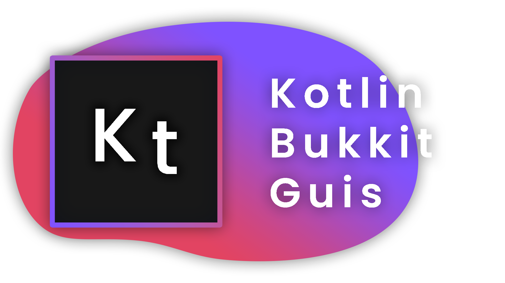

    

<h2 align="center">Multi-Platform Library for Minecraft development!</h2>

The KtGui library is available for usage on your Velocity proxy and your backend Paper servers!
Easily create reactive and flexible GUIs, with little to no code changes when switching platforms.

The library aims to give you utilities to make your plugins feel responsive and custom, at little to no
performance impact. **See just some of the feature below!**

<h3>

|&emsp;&emsp;
[Wiki](https://github.com/Matt-MX/KtBukkitGui/wiki) 
&emsp;&emsp;|&emsp;&emsp; 
[Downloads](https://github.com/Matt-MX/KtPaperGui/actions/workflows/build.yml)
&emsp;&emsp;|&emsp;&emsp; 
[Help](https://github.com/Matt-MX/KtBukkitGui/wiki)
&emsp;&emsp;|

</h3>

---

<h1>GUI DSL</h1>

Create your GUIs with a declarative pattern, making use of Kotlin's powerul DSL, it's never been easier to create fluent Inventory-based
GUIs, while keeping your code readable and maintainable.

<h3>

[View Examples »](https://github.com/Matt-MX/KtBukkitGui/blob/refactor/plugin/src/main/kotlin/com/mattmx/ktgui/examples/TitleCounterExample.kt)

</h3>

<h1>Signals</h1>

Signals are similar to `useState` hooks in React, allowing you to listen for state changes and react to the accordingly!
If you're using buttons to display variable values, you'll find this very useful.

<h3>

[« View Examples](https://github.com/Matt-MX/KtBukkitGui/blob/refactor/plugin/src/main/kotlin/com/mattmx/ktgui/examples/SignalsExample.kt)

</h3>

<h1>Brigadier Command DSL</h1>

KtGUI now comes with a strong wrapper for the Brigadier Command framework that is now exposed in the Paper and Velocity API.
Create subcommands with different executions dependant on the sender type, variables and more!

Now with flags and options!
 

<h3>

[View Examples »](https://github.com/Matt-MX/KtBukkitGui/blob/refactor/plugin/src/main/kotlin/com/mattmx/ktgui/KotlinGui.kt#L42)

</h3>

<h1>Events DSL</h1>

Create singleton listeners that can be registered and unregistered when you choose!

<h3>

[« View Examples](https://google.com/)

</h3>

<h1>GUI Hooks</h1>

Listen to events to modify any GUIs just before they get sent to a client!

Super useful if you want to modify a plugin's GUI without forking it!

<h3>

[View Examples »](https://github.com/Matt-MX/KtBukkitGui/blob/refactor/plugin/src/main/kotlin/com/mattmx/ktgui/examples/GuiHookExample.kt)

</h3>

<h1>Scoreboards</h1>

Making scoreboards has never been easier with our lightweight scoreboard DSL.
Now with the ability to define and animate your personalized scoreboards however you like!

<h3>

[« View Examples](https://github.com/Matt-MX/KtBukkitGui/blob/refactor/plugin/src/main/kotlin/com/mattmx/ktgui/examples/AnimatedScoreboardExample.kt)

</h3>

<!--

<h1>Hot Bar GUIs</h1>

Now you can create GUIs using the player inventory and hotbar interactions!

<h3>

[« View Examples](https://github.com/Matt-MX/KtBukkitGui/blob/refactor/plugin/src/main/kotlin/com/mattmx/ktgui/examples/AnimatedScoreboardExample.kt)

</h3>

<h1>Configurable GUIs</h1>

Read your GUIs from a JSON file format, using `action` hooks to delegate your click callbacks!

Give your plugins ultimate customization capabilities!

<h3>

[« View Examples](https://github.com/Matt-MX/KtBukkitGui/blob/refactor/plugin/src/main/kotlin/com/mattmx/ktgui/examples/AnimatedScoreboardExample.kt)

</h3>

-->
