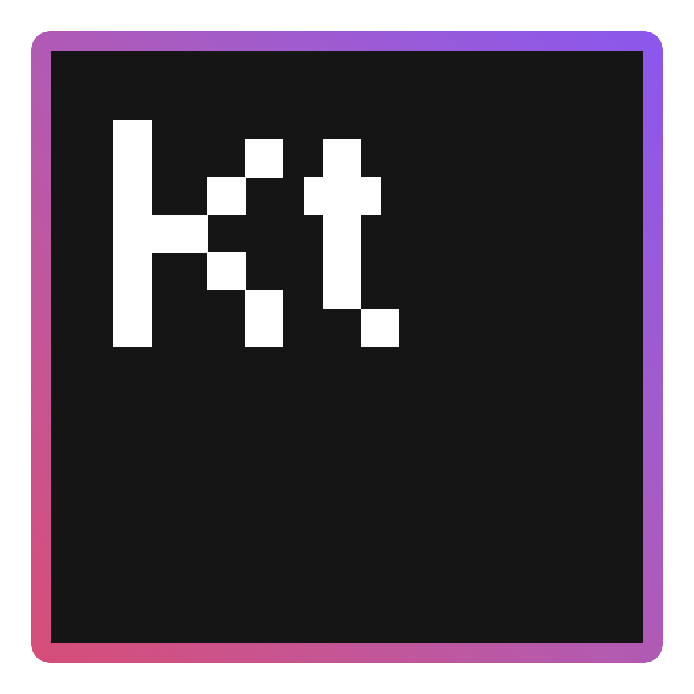

    

<h2 align="center">Declarative guis for Bukkit!</h2>

---

 

| <h2>About</h2> 
A lightweight GUI library with almost unlimited customization. Featuring a declarative style to make it easier for everyone to create beautiful GUIs with minimal code. We also bake our registered GUIs then format them to certain players.
                                   |                                                                                                                                                                                                                                                       |
|---------------------------------------------------------------------------------------------------------------------------------------------------------------------------------------------------------------------------------------------------------------------------------------------------------------------------|-----------------------------------------------------------------------------------------------------------------------------------------------------------------------------------------------------------------------------------------------------------------------------------------------|
|                                                                                                                                                                                                                                                                                                                           |                                                                                                                                                                                                                                                                                               |
| 

                                                                                                                              | <h2 align="center">Usage</h2> 
    To make it      even easier for people to take advantage of, we have provided some simple and stunning example guis. Click to view them. We also provide documentation in our code. Combined with the usages, what can't you do?
 |
| <h2 align="center">Examples</h2> 
We have provided plenty of examples of usages. This includes creating GUIs on the fly as well as making them ready for usage. Since this is written in kotlin, the library works perfect with Java and is just as easy to use and lightweight as in Kotlin!
 | 

                                                                                                                                                                                                                                      |

<h2 id="example_buttons" align="right">Dynamic buttons</h2>

| 

 | 
The Component based system allows for you to create your own widgets and button types. Different types of buttons may behave differently and control parts of your server/plugin. We even offer a few pre-made custom buttons for you to play around with. <a href="https://github.com/Matt-MX/KtBukkitGui/blob/master/src/main/kotlin/com/mattmx/ktgui/examples/ConfigScreenExample.kt">Check out the code »</a>
 |
|-------------------------------------------------------------|----------------------------------------------------------------------------------------------------------------------------------------------------------------------------------------------------------------------------------------------------------------------------------------------------------------------------------------------------------------------------------------------------------------------------------------------------|

<h2 id="example_static">Pre-defined GUIs</h2>

| 
This example shows off a lightweight GUI example. Look at what you can achieve with only a few lines of code! <a href="https://github.com/Matt-MX/KtBukkitGui/blob/master/src/main/kotlin/com/mattmx/ktgui/examples/CustomGUI.kt">Check out the code »</a>
 | 

 |
|-----------------------------------------------------------------------------------------------------------------------------------------------------------------------------------------------------------------------------------------------------------------------------------|-------------------------------------------------------------------|

<h2 id="realtime" align="right">Realtime built GUIs</h2>

| 

 | 
Want to create GUIs dynamically? We support that! Simple create a new `GuiScreen` object and treat it as you would normally. This can allow you to make guis do whatever you want, whenever you want! <a href="https://github.com/Matt-MX/KtBukkitGui/blob/master/src/main/kotlin/com/mattmx/ktgui/examples/DynamicExample.kt#L20">Check out the code »</a>
 |
|--------------------------------------------------------------------|-------------------------------------------------------------------------------------------------------------------------------------------------------------------------------------------------------------------------------------------------------------------------------------------------------------------------------------------------------------------------------------|

<h2 id="example_furnace">Other Types of GUIs</h2>

| 
We also offer the same easy-to-use support for every type of GUI in the game, here's a quick example of a custom furnace GUI. <a href="https://github.com/Matt-MX/KtBukkitGui/blob/master/src/main/kotlin/com/mattmx/ktgui/examples/DynamicExample.kt#L77">Check out the code »</a>
 | 

 |
|------------------------------------------------------------------------------------------------------------------------------------------------------------------------------------------------------------------------------------------------------------------------------------------------------------|------------------------------------------------------------------------|

<h2 id="example_conversation" align="right">Conversation API</h2>

| 

 | 
Comes with a build-in conersation API to make it easy for you to get string player input. Quickly build lightweight conversations and execute them per-player to get different types of input from them: Player names, strings, numbers (with range), fixed inputs. <a href="https://github.com/Matt-MX/KtBukkitGui/blob/master/src/main/kotlin/com/mattmx/ktgui/examples/ConversationGuiExample.kt">Check out the code »</a>
 |
|-----------------------------------------------------------------------------|------------------------------------------------------------------------------------------------------------------------------------------------------------------------------------------------------------------------------------------------------------------------------------------------------------------------------------------------------------------------------------------------------------------------------------------------------------|

<h2 id="example_furnace">Animated and normal scoreboards</h2>

| 
We like to make ourself proud of our extremely lightweight scoreboard API. We give you the option, built-in, to create animated or static scoreboards to pretty-up your server. <a href="https://github.com/Matt-MX/KtBukkitGui/blob/master/src/main/kotlin/com/mattmx/ktgui/examples/ScoreboardExample.kt">Static Example »</a> <a href="https://github.com/Matt-MX/KtBukkitGui/blob/master/src/main/kotlin/com/mattmx/ktgui/examples/AnimatedScoreboardExample.kt">Animated Example »</a>
 | 

 |
|--------------------------------------------------------------------------------------------------------------------------------------------------------------------------------------------------------------------------------------------------------------------------------------------------------------------------------------------------------------------------------------------------------------------------------------------------------------------------------------------------------------------------|---------------------------------------------------------------------------|
